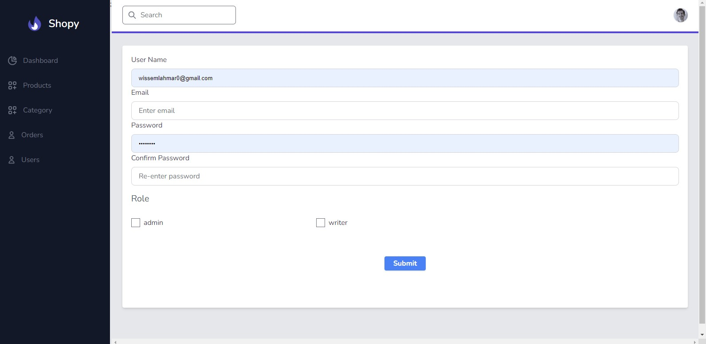
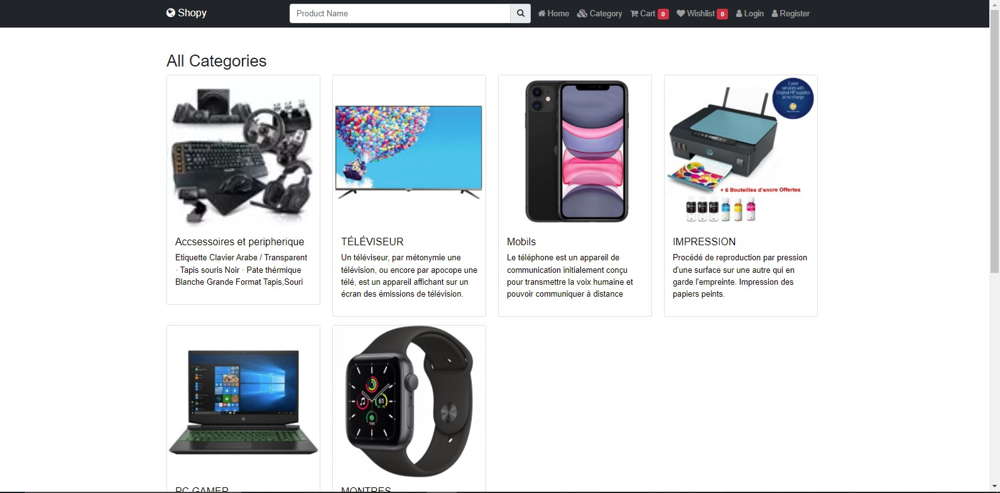
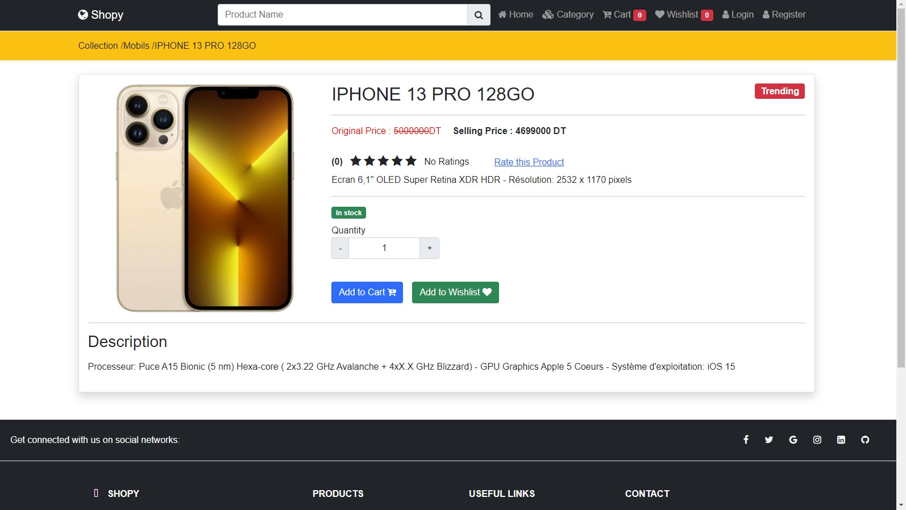

# Site_E_Commerce-
An online computer equipment sales website.

    
    
    
    
    
     
    
     
    
     
    
     
    
     
     
     
     
     
     
    

  
  

## Technologies :
1. laravel
2. Jquery Css JavaScript Html

# For the user:

1. Create an account
2. Log in
3. View products
4. Add a product to the cart
5. Remove a product from the cart
6. Add a product to the wishlist
7. View order details
8. Place an order
9. Edit shipping details
10. Rate a product
11. Search for a product

# For the admin:

1. Add a product
2. Modify a product
3. Delete a product
4. Add a category
5. Modify a category
6. Delete a category
7. Approve orders
8. View list of users
9. Add an admin

# Here are the steps for executing a Laravel project from GitHub:

1. Clone the repository to your local machine by running the command git clone https://github.com/username/repositoryname.git.

2. Navigate to the project directory by running the command cd repositoryname.

3. Install the required dependencies by running the command composer install.

4. Set up the database connection in the .env file by specifying the database host, name, username, and password.

5. Run the command php artisan migrate to create the necessary tables in the database.

6. Run the command php artisan key:generate to generate an application key.

7. Run the command php artisan serve to start the local development server.

8. Test the application by accessing it through the URL http://localhost:8000.

9. If necessary, configure any additional settings or environment variables in the .env file.

